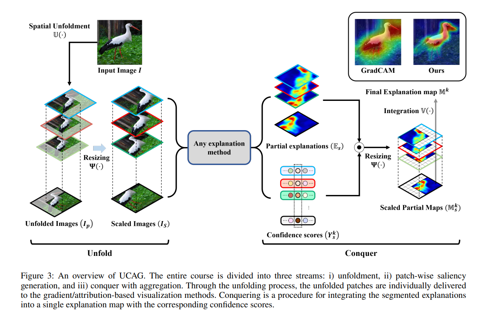

# UCAG
This repository contains a code of **Towards Better Visualizing the Decision Basis of Networks via Unfold and Conquer Attribution Guidance**, which is presented at a conference of the Association for the Advancement of Artificial Intelligence (AAAI) 2023. 


**Paper**: [AAAI 2023](https://ojs.aaai.org/index.php/AAAI/article/download/25954/25726)

**Abstract**
Revealing the transparency of Deep Neural Networks (DNNs) has been widely studied to describe the decision mechanisms of network inner structures. In this paper, we propose a novel post-hoc framework, Unfold and Conquer Attribution Guidance (UCAG), which enhances the explainability of the network decision by spatially scrutinizing the input features with respect to the model confidence. Addressing the phenomenon of missing detailed descriptions, UCAG sequentially complies with the confidence of slices of the image, leading to providing an abundant and clear interpretation. Therefore, it is possible to enhance the representation ability of explanation by preserving the detailed descriptions of assistant input features, which are commonly overwhelmed by the main meaningful regions. We conduct numerous evaluations to validate the performance in several metrics: i) deletion and insertion, ii) (energy-based) pointing games, and iii) positive and negative density maps. Experimental results, including qualitative comparisons, demonstrate that our method outperforms the existing methods with the nature of clear and detailed explanations and applicability.

## Visualization
```
python visualization.py gradcam --name resnet50 -a 2.6 -c 124 -n 6 --img-path /path/to/imagenet/val --ucag
```

## Insertion and Deletion test
```
python insdel.py gradcam --name resnet50 -a 2.6 -c 124 -n 6 --img-path /path/to/imagenet/val/ --ucag
```

## Hyper-parameters
- a decides ratio of image up-sampling, e.g., a=2.6 means x2.6 upsampling
- c decides crop size
- n decides the number of patches, i.e., n=6 -> generate (h, w) = (6, 6) patches, total 36 patches

## BibTex
```
@inproceedings{hong2023towards,
  title={Towards Better Visualizing the Decision Basis of Networks via Unfold and Conquer Attribution Guidance},
  author={Hong, Jung-Ho and Nam, Woo-Jeoung and Jeon, Kyu-Sung and Lee, Seong-Whan},
  booktitle={Proceedings of the AAAI Conference on Artificial Intelligence},
  volume={37},
  number={7},
  pages={7884--7892},
  year={2023}
}
```

## Logs
TODO list:

- [ ] add toy examples
- [ ] release the evaluation code
- [x] extend the idea to ViT

